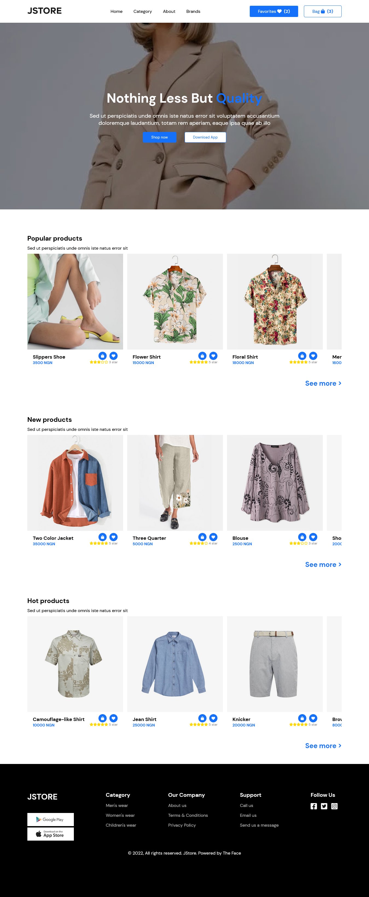

# JStore

### Screenshot



### Link

- Live Site URL: [Visit live site](https://jstore-theface.netlify.app)

### Built with

- Semantic HTML5 markup
- CSS custom properties
- Vue JS

## Author

- Portfolio - [Ezekiel The Face](https://thefacecodes.web.app)
- Twitter - [@zeekcodes](https://www.twitter.com/zeekcodes)

## Project setup
```
npm install
```

### Compiles and hot-reloads for development
```
npm run serve
```

### Compiles and minifies for production
```
npm run build
```

### Run your unit tests
```
npm run test:unit
```

### Run your end-to-end tests
```
npm run test:e2e
```

### Lints and fixes files
```
npm run lint
```

### Customize configuration
See [Configuration Reference](https://cli.vuejs.org/config/).
